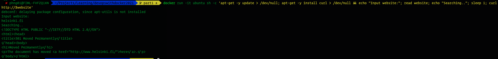

# devopswithdocker2021

# 1.1: Getting started


# 1.2: Cleanup


# 1.3: Secret message


# 1.4: Missing dependencies

Solution:

The command:
```bash
docker run -it ubuntu sh -c 'apt-get -y update > /dev/null; apt-get -y install curl > /dev/null && echo "Input website:"; read website; echo "Searching.."; sleep 1; curl http://$website'
```

# 1.5 Sizes of images

```bash
$ docker image ls | grep simple
devopsdockeruh/simple-web-service   ubuntu    4e3362e907d5   5 weeks ago   83MB
devopsdockeruh/simple-web-service   alpine    fd312adc88e0   5 weeks ago   15.7MB
```


# 1.6 Hello Docker Hub

```bash
$ docker run -it devopsdockeruh/pull_exercise
Give me the password: basics
You found the correct password. Secret message is:
"This is the secret message"
```

# 1.7: Two line Dockerfile

Dockerfile:
```Dockerfile
FROM devopsdockeruh/simple-web-service:alpine

WORKDIR /usr/src/app

CMD server
```
Commands and results:


# 1.8: Image for script

Dockerfile
```Dockerfile
FROM ubuntu:18.04

WORKDIR /usr/src/app

RUN apt-get -y update; apt-get -y install curl

CMD echo "Input website:"; read website; echo "Searching.."; sleep 1; curl http://$website
```

Commands and results:

- Build image:
```bash
docker build . -t curler 
```
- Run the container:


# 1.9: Volumes

```bash
docker run -v "$(pwd):/usr/src/app" devopsdockeruh/simple-web-service
```


# 1.10: Ports open

```bash
docker run -p 8080 web-server
```

# 1.12 Hello, frontend

Dockerfile 
```Dockerfile
FROM node:14

EXPOSE 5000

WORKDIR /usr/src/app

COPY . .

RUN npm install
RUN npm run build
RUN npm install -g serve

CMD serve -s -l 5000 build
```
Commands:
```bash
docker build -t docker-course-frontend .  
```
```bash
docker run -it -p 5000:5000 docker-course-frontend
```

# 1.13 Hello, backend

Dockerfile
```Dockerfile
FROM golang:1.16

EXPOSE 8080

WORKDIR /usr/src/app

COPY . .

RUN go build

CMD ./server

```

Commands:
```bash
docker build -t docker-course-backend .  
```
```bash
docker run -it -p 8080:8080 docker-course-backend
```


# 1.14: Environment

Updated Frontend Dockerfile:
```Dockerfile
FROM node:14

EXPOSE 5000

WORKDIR /usr/src/app

COPY . .

RUN npm install
RUN REACT_APP_BACKEND_URL=http://localhost:8080 npm run build
RUN npm install -g serve

CMD serve -s -l 5000 build
```

Commands:
```bash
docker build -t docker-course-frontend .  
```
```bash
docker run -it -p 5000:5000 docker-course-frontend
```

Updated Backend Dockerfile
```Dockerfile
FROM golang:1.16

EXPOSE 8080

WORKDIR /usr/src/app

COPY . .

ENV REQUEST_ORIGIN *

RUN go build

CMD ./server
```

Commands:
```bash
docker build -t docker-course-backend .  
```
```bash
docker run -it -p 8080:8080 docker-course-backend
```